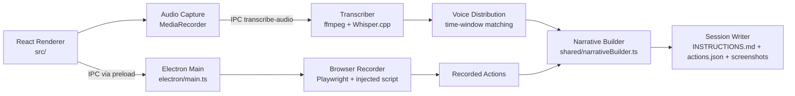

# Project Overview
KiwiGen is an Electron + React desktop app that records browser interactions and optional
voice commentary, then exports AI-ready session bundles (`INSTRUCTIONS.md`, `actions.json`,
`screenshots/`) for automated test generation across frameworks such as Playwright and Cypress.
It focuses on local-first processing (Whisper.cpp + ffmpeg) and ships with platform build flows
for macOS ARM64 and Windows x64.

## Repository Structure
- `.github/` - GitHub templates and CI workflow for cross-platform production builds.
- `build/` - Build, packaging, icon generation, and Playwright browser install scripts.
- `dist/` - Generated renderer build output (Vite; do not edit manually).
- `dist-electron/` - Generated Electron build output (do not edit manually).
- `docs/` - Product, architecture, build, debugging, and feature deep-dive documentation.
- `electron/` - Electron main/preload code, IPC handlers, recorder, transcription, and settings.
- `models/` - Whisper binaries and model location (`ggml-small.en.bin` downloaded manually).
- `node_modules/` - Installed dependencies (generated; do not edit manually).
- `playwright-browsers/` - Locally installed Playwright browser binaries used by the app.
- `release/` - Packaged app artifacts from `electron-builder` (generated).
- `shared/` - Shared types/constants/utilities used by main and renderer processes.
- `src/` - React renderer app (components, hooks, store, types, styling).
- `test-context/` - Reserved test context workspace (currently empty).
- `test-results/` - Playwright artifacts/results output (generated).
- `test-sessions/` - Local recorded session outputs for manual testing (generated/ignored).
- `tests/` - Test scaffolding directories (`e2e`, `helpers`, `fixtures`), currently minimal.

## Build & Development Commands
```bash
# Install dependencies (runs postinstall browser install)
npm install

# Reinstall bundled Playwright browsers manually
npm run install:browsers

# Download required Whisper model (466 MB)
curl -L -o models/ggml-small.en.bin \
  https://huggingface.co/ggerganov/whisper.cpp/resolve/main/ggml-small.en.bin
```

```bash
# Run app in development mode (Vite + Electron watch)
npm run dev
```

```bash
# Local unsigned test build (macOS ARM64)
npm run build

# Production build (signed/notarized on macOS when env vars are set)
npm run build:prod

# Generate app icons
npm run generate-icons
```

```bash
# Type-check renderer and Electron/shared code
npx tsc --noEmit
npx tsc -p tsconfig.node.json
```

> TODO: No dedicated `npm test` script is defined in `package.json`.

> TODO: No dedicated lint script/config (ESLint/Prettier) is defined in repo root.

```bash
# Debug production logs (macOS)
tail -f ~/Library/Logs/kiwigen/main.log
```

```bash
# Release tagging/deploy prep (from docs/building.md)
git tag -a v0.3.0 -m "Release v0.3.0"
git push origin v0.3.0
```

> TODO: No single local deploy command exists; release uploads are handled via
> `.github/workflows/build.yml` (`workflow_dispatch`).

## Code Style & Conventions
- TypeScript is strict (`strict: true`, `noUnusedLocals`, `noUnusedParameters`,
  `noFallthroughCasesInSwitch`).
- Use path alias `@/*` for renderer imports (`@/components/...`, `@/stores/...`).
- Naming follows existing patterns: React components in `PascalCase`, hooks as `useX`,
  utility modules in `camelCase`, and shared type names in `PascalCase`.
- Follow file-local style when editing (TS/TSX commonly uses single quotes and no semicolons;
  build scripts in `build/*.js` use semicolons).
- Keep IPC boundaries explicit: renderer calls `window.electronAPI.*`; privileged work stays in
  `electron/`.
- Lint configuration:
  - > TODO: Repository has no root ESLint/Prettier config; standardize and document formatter/lint
    rules.
- Commit message template (based on current history style):
  1. `<area>: <short imperative summary>`
  2. Example: `recording: handle no-action transcript generation`

## Architecture Notes


The app uses Electron's two-process model: a sandboxed React renderer (`src/`) for UI and
state, and a privileged main process (`electron/`) for filesystem, browser automation, and
transcription. The renderer starts/stops recording through IPC, the main process launches a
Playwright browser with injected capture scripts, and actions stream back to UI in real time.
Voice audio is recorded in renderer memory, sent for local transcription (ffmpeg preprocessing +
Whisper.cpp), aligned to actions using configurable timing windows, then serialized by the
session writer into a compact AI-consumable bundle.

## Testing Strategy
- Unit tests:
  - > TODO: No unit test framework/config is currently wired (no `npm test`, Jest, or Vitest).
- Integration tests:
  - > TODO: No dedicated integration test runner/config is currently wired.
- E2E tests:
  - `tests/` contains E2E scaffolding (`tests/e2e`, `tests/helpers`, `tests/fixtures`), but there
    are currently no committed spec files.
- Local verification today:
  1. Run `npm run dev` and validate recorder/transcription flows manually.
  2. Run `npm run build` for packaging sanity checks.
  3. Run `npx tsc --noEmit` and `npx tsc -p tsconfig.node.json` for type safety.
- CI verification:
  - `.github/workflows/build.yml` runs `npm ci` + `npm run build:prod` for macOS/Windows and
    uploads artifacts.
  - > TODO: Add automated test execution stage(s) to CI once test suites are implemented.

## Security & Compliance
- Keep secrets out of git: `.env`, certificate files (`*.p12`, `*.pem`), and credentials are
  gitignored; use `.env.example` as template.
- macOS signing/notarization secrets are passed via GitHub Actions secrets (`APPLE_ID`,
  `APPLE_APP_SPECIFIC_PASSWORD`, `APPLE_TEAM_ID`, certificate/password).
- Security vulnerability reporting is private via `SECURITY.md` email contact.
- Data handling is local-first: transcription runs locally with Whisper.cpp; no cloud STT path is
  documented.
- Dependency and vulnerability scanning:
  - > TODO: No explicit dependency scanning step is configured in CI.
- License:
  - Project is MIT licensed (`LICENSE`).

## Agent Guardrails
- Never modify or commit secrets/credentials (`.env*`, `certificate.p12`, keys, signing secrets).
- Treat generated outputs as read-only unless explicitly asked: `dist/`, `dist-electron/`,
  `release/`, `node_modules/`, `test-results/`, `test-sessions/`.
- Do not alter bundled binaries/models (`models/unix/whisper`, `models/win/*`, model artifacts)
  unless the task is explicitly about binary/model updates.
- Require human review for changes to signing/release/CI surfaces:
  `electron-builder*.json`, `.github/workflows/`, `build/build-prod.js`.
- Preserve Electron security boundaries: no direct Node access from renderer; use `preload` + IPC.
- Prefer minimal, scoped edits and keep docs in sync when output format/architecture changes.
- Rate limits:
  - > TODO: No explicit API/network rate-limit policy is defined; keep external downloads minimal
    and deterministic.

## Extensibility Hooks
- IPC extension points:
  1. Add handlers in `electron/ipc/recording.ts` or `electron/ipc/session.ts`.
  2. Register centrally in `electron/ipc/handlers.ts`.
  3. Expose safe bridge methods via `electron/preload.ts` and `src/types/electron.d.ts`.
- Recording/action extensibility:
  - Browser capture behavior lives in `electron/browser/injected-script.ts` and
    `electron/browser/recorder.ts`.
- Output extensibility:
  - Narrative generation is centralized in `shared/narrativeBuilder.ts`.
  - Session template content is controlled in `electron/session/instructions-template.ts`.
- Runtime configuration hooks:
  - Persistent settings are in `electron/settings/store.ts` (voice windows, output options,
    transcription timeout, user preferences, selected microphone).
- Environment variables in active use:
  - `VITE_DEV_SERVER_URL`, `NODE_ENV`, `PLAYWRIGHT_BROWSERS_PATH`,
    `APPLE_ID`, `APPLE_APP_SPECIFIC_PASSWORD`, `APPLE_TEAM_ID`, `CSC_LINK`,
    `CSC_KEY_PASSWORD`, `CSC_NAME`.
- Feature flags:
  - > TODO: No formal feature-flag system is currently defined.

## Further Reading
- [README.md](README.md)
- [docs/architecture.md](docs/architecture.md)
- [docs/building.md](docs/building.md)
- [docs/user_guide.md](docs/user_guide.md)
- [docs/output_format.md](docs/output_format.md)
- [docs/voice_transcription.md](docs/voice_transcription.md)
- [docs/logs_and_debugging.md](docs/logs_and_debugging.md)
- [docs/PROJECT_DEEP_DIVE.md](docs/PROJECT_DEEP_DIVE.md)
- [SECURITY.md](SECURITY.md)
