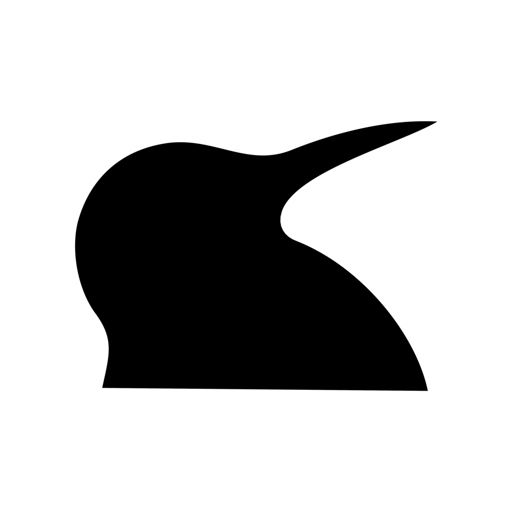
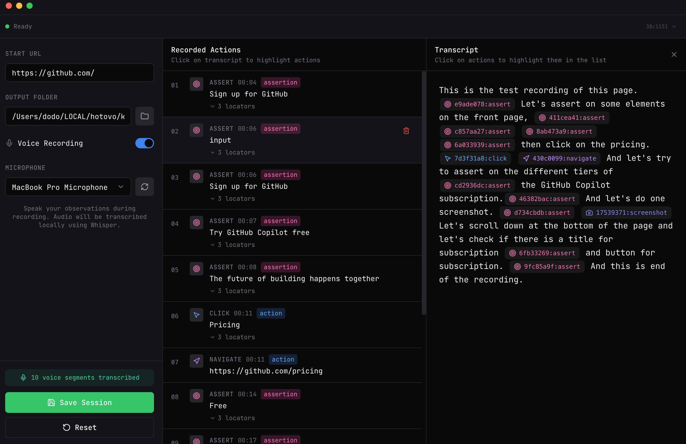

<p align="center">
  
</p>

<h1 align="center">KiwiGen</h1>

<p align="center">
  <strong>AI-Ready Browser Interaction Recording for Automated Test Generation</strong>
</p>

<p align="center">
  A desktop application for recording browser interactions and voice commentary, producing session bundles optimized for AI-assisted test generation.
</p>



---

## 🖥️ Platform Support

**Supported Platforms:**
- ✅ **macOS Apple Silicon (ARM64)**
- ✅ **Windows x64**

## 🎯 Overview

KiwiGen transforms manual browser testing into AI-ready session bundles. Record your interactions, speak your test intentions, and let the app generate comprehensive documentation that AI agents can use to write tests automatically.

**What makes KiwiGen special:**

- 🎙️ **Voice Sync**: Speak naturally while testing—your commentary is automatically transcribed and synced with your actions
- 🎭 **Framework-Agnostic Output**: Works with Playwright, Cypress, Selenium, Puppeteer, or any testing framework
- 🤖 **AI-Optimized**: Session bundles include complete instructions for AI agents—no external documentation needed
- 📸 **Smart Locators**: Multiple locator strategies (testId, text, role, css, xpath) with confidence levels
- ✅ **Assertion Mode**: Record visual assertions with Cmd/Ctrl + Click

---

## ✨ Key Features

### 📦 Session Output

Each recording produces a framework-agnostic session bundle with just 3 components:

```
session-YYYY-MM-DD-HHMMSS/
├── INSTRUCTIONS.md    # General AI instructions (reusable across sessions)
├── actions.json       # Complete session data (metadata + narrative + actions)
└── screenshots/       # Visual captures
```

**What's in each file:**
- **INSTRUCTIONS.md**: Framework-agnostic + framework-specific instructions for AI agents. Written once per output directory, reused across all sessions.
- **actions.json**: All session data in one file - metadata, voice narrative with embedded action references, and action array with multiple locator strategies.
- **screenshots/**: PNG captures referenced by actions.

**Action Reference Format**: Actions are referenced in the narrative as `[action:SHORT_ID:TYPE]` where:
- `SHORT_ID` = First 8 characters of the UUID in actions.json
- Example: `[action:8c61934e:click]` maps to `"id": "8c61934e-4cd3-4793-bdb5-5c1c6d696f37"`

**Why this structure?**
- ✅ **Token efficient**: Few tokens per session (INSTRUCTIONS.md is reused)
- ✅ **Single source**: All session data in one JSON file
- ✅ **Framework detection**: INSTRUCTIONS.md includes Playwright/Cypress auto-detection logic
- ✅ **AI-ready**: Complete instructions embedded, no external docs needed

### 🎮 Recording Controls

**Floating Widget** (appears in browser top-right corner):
- 📸 Take screenshots
- ✅ Toggle assertion mode (auto-disables after recording an assertion)
- 👻 Never recorded in your interactions

**Keyboard Shortcuts:**

| Shortcut | Action |
|----------|--------|
| **Cmd+Shift+S** (Mac)<br>**Ctrl+Shift+S** (Windows) | Take Screenshot |
| **Cmd + Click** (Mac)<br>**Ctrl + Click** (Windows) | Record Assertion |

### 🔐 Privacy & Local Processing

- **No Cloud Dependencies**: All transcription happens locally using Whisper.cpp
- **Your Data Stays Local**: Session bundles remain on your machine
- **Safer Session Exports**: Recorded URLs redact query/fragment values, and password/token-like form fills are exported as `[REDACTED]`

---

## 🛠️ Development Setup

For detailed build and development instructions, see [`docs/DEVELOPMENT.md`](docs/DEVELOPMENT.md).

### Quick Start

```bash
# Clone and install dependencies
git clone https://github.com/hotovo/kiwigen.git
cd kiwigen
npm install

# Run in development mode
npm run dev
```

### Development Dependencies

For development, you'll need to install Playwright browsers and download the Whisper model:

```bash
# Install Playwright browsers (done automatically via postinstall)
npm run install:browsers

# Download Whisper model for local development
mkdir -p models
curl -L -o models/ggml-small.en.bin \
  https://huggingface.co/ggerganov/whisper.cpp/resolve/main/ggml-small.en.bin
```

### Project Structure

```
kiwigen/
├── models/                          # Whisper components (bundled in installer)
│   ├── unix/                       # Unix binary (macOS)
│   │   └── whisper                # Whisper.cpp binary (committed)
│   ├── win/                        # Windows binaries
│   │   └── whisper-cli.exe         # Whisper.cpp binary (committed)
│   └── ggml-small.en.bin          # AI model (download for development)
├── electron/                        # Electron main process
│   ├── main.ts                     # Entry point
│   ├── browser/                    # Playwright recording
│   ├── audio/                      # Audio & transcription
│   ├── session/                    # Session management
│   ├── ipc/                        # IPC handlers
│   ├── settings/                    # Settings persistence
│   └── utils/                      # Filesystem, validation, logging
├── src/                             # React renderer process
│   ├── components/                 # UI components
│   ├── stores/                     # Zustand state management
│   ├── hooks/                      # Custom React hooks
│   ├── lib/                        # Utilities and settings
│   └── types/                      # TypeScript types
├── shared/                          # Shared types and constants
└── docs/                            # Documentation
```

---

## 📝 Reporting Issues

Found a bug or have a feature request? Please open an issue on [GitHub Issues](https://github.com/hotovo/kiwigen/issues).

---

## 🔧 Troubleshooting

For comprehensive troubleshooting guides, see [`docs/USER_GUIDE.md`](docs/USER_GUIDE.md#troubleshooting).

### Common Issues

### Debugging

- **Console logs**: Visible in terminal when running `npm run dev`
- **DevTools**: Press `Cmd+Option+I` (Mac) or `Ctrl+Shift+I` (Windows) to open browser DevTools
- **Log files** (production builds): See [`docs/USER_GUIDE.md`](docs/USER_GUIDE.md#troubleshooting)

---

## ❓ FAQ

**Q: Why is the installer so large?**
A: The installer bundles all necessary dependencies in a single file for security and reliability. This includes the complete Electron runtime, Chromium browser for recording, Whisper AI model for voice transcription, and all required libraries. No additional downloads are needed - everything works offline immediately after installation.

**Q: Can I use a different Whisper model?**
A: The app is hard-coded to use `small.en` for consistency and performance.

**Q: Does this work with frameworks other than Playwright?**
A: Yes! The session output is framework-agnostic. AI agents can generate tests for Playwright, Cypress, Selenium, Puppeteer, or any other framework.

**Q: Is my voice data sent to the cloud?**
A: No. All transcription happens locally using Whisper.cpp. Your voice recordings never leave your machine.

---

## 📚 Documentation

- **[User Guide](docs/USER_GUIDE.md)**: Complete user-facing documentation for using KiwiGen
- **[Development Guide](docs/DEVELOPMENT.md)**: Comprehensive implementation guide for developers and AI agents working on the codebase
- **[Agent Guidelines](AGENTS.md)**: Coding standards and guidelines for AI agents (for reference)

---

## 🏢 About

KiwiGen is developed and maintained by [Hotovo](https://github.com/hotovo).

---

## 📄 License

MIT License - Copyright (c) 2026 Hotovo. See [LICENSE](LICENSE) for details.
