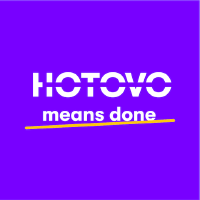

<h1 align="center">Dodo Recorder</h1>

<p align="center">
  <strong>AI-Ready Browser Interaction Recording for Automated Test Generation</strong>
</p>

<p align="center">
  A desktop application for recording browser interactions and voice commentary, producing session bundles optimized for AI-assisted test generation.
</p>

<p align="center">
  
</p>

<p align="center">
  Developed under <strong>Hotovo</strong> • More projects: <a href="https://github.com/hotovo">https://github.com/hotovo</a>
</p>

<p align="center">
  <strong>Active Development</strong> • Open Source
</p>


---

## 🖥️ Platform Support

**Supported Platforms:**
- ✅ **macOS Apple Silicon (ARM64)**
- ✅ **Windows x64**

## 🎯 Overview

Dodo Recorder transforms manual browser testing into AI-ready session bundles. Record your interactions, speak your test intentions, and let the app generate comprehensive documentation that AI agents can use to write tests automatically.

**What makes Dodo Recorder special:**

- 🎙️ **Voice Sync**: Speak naturally while testing—your commentary is automatically transcribed and synced with your actions
- 🎭 **Framework-Agnostic Output**: Works with Playwright, Cypress, Selenium, Puppeteer, or any testing framework
- 🤖 **AI-Optimized**: Session bundles include complete instructions for AI agents—no external documentation needed
- 📸 **Smart Locators**: Multiple locator strategies (testId, text, role, css, xpath) with confidence levels
- ✅ **Assertion Mode**: Record visual assertions with Cmd/Ctrl + Click

---

## ✨ Key Features

### 📦 Session Output

Each recording produces a framework-agnostic session bundle with just 3 components:

```
session-YYYY-MM-DD-HHMMSS/
├── INSTRUCTIONS.md    # General AI instructions (reusable across sessions)
├── actions.json       # Complete session data (metadata + narrative + actions)
└── screenshots/       # Visual captures
```

**What's in each file:**
- **INSTRUCTIONS.md**: Framework-agnostic + framework-specific instructions for AI agents. Written once per output directory, reused across all sessions.
- **actions.json**: All session data in one file - metadata, voice narrative with embedded action references, and action array with multiple locator strategies.
- **screenshots/**: PNG captures referenced by actions.

**Action Reference Format**: Actions are referenced in the narrative as `[action:SHORT_ID:TYPE]` where:
- `SHORT_ID` = First 8 characters of the UUID in actions.json
- Example: `[action:8c61934e:click]` maps to `"id": "8c61934e-4cd3-4793-bdb5-5c1c6d696f37"`

**Why this structure?**
- ✅ **Token efficient**: Few tokens per session (INSTRUCTIONS.md is reused)
- ✅ **Single source**: All session data in one JSON file
- ✅ **Framework detection**: INSTRUCTIONS.md includes Playwright/Cypress auto-detection logic
- ✅ **AI-ready**: Complete instructions embedded, no external docs needed

### 🎮 Recording Controls

**Floating Widget** (appears in browser top-right corner):
- 📸 Take screenshots
- ✅ Toggle assertion mode (auto-disables after recording an assertion)
- 👻 Never recorded in your interactions

**Keyboard Shortcuts:**

| Shortcut | Action |
|----------|--------|
| **Cmd+Shift+S** (Mac)<br>**Ctrl+Shift+S** (Windows) | Take Screenshot |
| **Cmd + Click** (Mac)<br>**Ctrl + Click** (Windows) | Record Assertion |

### 🔐 Privacy & Local Processing

- **No Cloud Dependencies**: All transcription happens locally using Whisper.cpp
- **Your Data Stays Local**: Session bundles remain on your machine

---

## 🛠️ Development Setup

For detailed build and development instructions, see [`docs/DEVELOPMENT.md`](docs/DEVELOPMENT.md).

### Quick Start

```bash
# Clone and install dependencies
git clone https://github.com/dodosaurus/dodo-recorder.git
cd dodo-recorder
npm install

# Run in development mode
npm run dev
```

Runtime dependencies (Whisper + Chromium) are now installed by the app on first launch.

### First-Launch Runtime Download

On first startup, the app installs required runtime dependencies from GitHub Release assets for the current app version:

- **Whisper model** (`ggml-small.en.bin`, ~466 MB)
- **Whisper binary** (platform-specific executable)
- **Playwright Chromium runtime** (platform-specific browser archive)

**Why this is done on first launch (instead of bundling):**
- Smaller app installers and faster downloads
- Runtime assets can be updated per release without inflating packaged binaries
- Deterministic setup with checksum verification before use

The dependencies are installed once per user profile and reused between launches until a newer runtime version is required.

### Project Structure

```
dodo-recorder/
├── models/                          # Whisper components (source for release packaging)
│   ├── unix/                       # Unix binary (macOS)
│   │   └── whisper                # Whisper.cpp binary (committed)
│   ├── win/                        # Windows binaries
│   │   └── whisper-cli.exe         # Whisper.cpp binary (committed)
│   └── ggml-small.en.bin          # AI model (download manually for development)
├── electron/                        # Electron main process
│   ├── main.ts                     # Entry point
│   ├── browser/                    # Playwright recording
│   ├── audio/                      # Audio & transcription
│   ├── runtime/                     # Runtime dependency management
│   ├── session/                    # Session management
│   ├── ipc/                        # IPC handlers
│   ├── settings/                    # Settings persistence
│   └── utils/                      # Filesystem, validation, logging
├── src/                             # React renderer process
│   ├── components/                 # UI components
│   ├── stores/                     # Zustand state management
│   ├── hooks/                      # Custom React hooks
│   ├── lib/                        # Utilities and settings
│   └── types/                      # TypeScript types
├── shared/                          # Shared types and constants
└── docs/                            # Documentation
```

---

## 📝 Reporting Issues

Found a bug or have a feature request? Please open an issue on [GitHub Issues](https://github.com/dodosaurus/dodo-recorder/issues).

---

## 🔧 Troubleshooting

For comprehensive troubleshooting guides, see [`docs/USER_GUIDE.md`](docs/USER_GUIDE.md#troubleshooting).

### Common Issues

**"Runtime dependency install failed" Error:**
- Re-run setup from the first-launch setup screen
- Check network access to GitHub release assets
- Review app logs in `main.log` for download/checksum details

### Debugging

- **Console logs**: Visible in terminal when running `npm run dev`
- **DevTools**: Press `Cmd+Option+I` (Mac) or `Ctrl+Shift+I` (Windows) to open browser DevTools
- **Log files** (production builds): See [`docs/USER_GUIDE.md`](docs/USER_GUIDE.md#troubleshooting)

---

## ❓ FAQ

**Q: What exactly is downloaded on first startup?**
A: Three runtime artifacts: Whisper model (`ggml-small.en.bin`), platform-specific Whisper binary, and platform-specific Playwright Chromium archive.

**Q: Why are these dependencies downloaded after install instead of bundled?**
A: To keep installers smaller, speed up distribution, and let runtime assets be versioned and updated per release while still being verified with SHA256 checksums.

**Q: Can I use a different Whisper model?**
A: The app is hard-coded to use `small.en` for consistency and performance.

**Q: Do I need to download runtime dependencies on every app launch?**
A: No. They install once per machine/user profile and are reused between launches until the runtime version changes.

**Q: Does this work with frameworks other than Playwright?**
A: Yes! The session output is framework-agnostic. AI agents can generate tests for Playwright, Cypress, Selenium, Puppeteer, or any other framework.

**Q: Is my voice data sent to the cloud?**
A: No. All transcription happens locally using Whisper.cpp. Your voice recordings never leave your machine.

---

## 📚 Documentation

- **[User Guide](docs/USER_GUIDE.md)**: Complete user-facing documentation for using Dodo Recorder
- **[Development Guide](docs/DEVELOPMENT.md)**: Comprehensive implementation guide for developers and AI agents working on the codebase
- **[Agent Guidelines](AGENTS.md)**: Coding standards and guidelines for AI agents (for reference)

---

## 📄 License

MIT License - see [LICENSE](LICENSE) for details.
